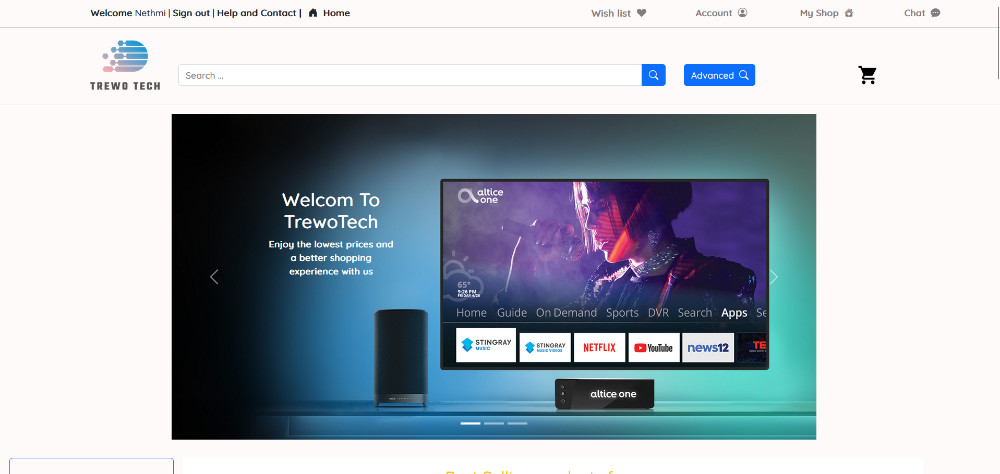
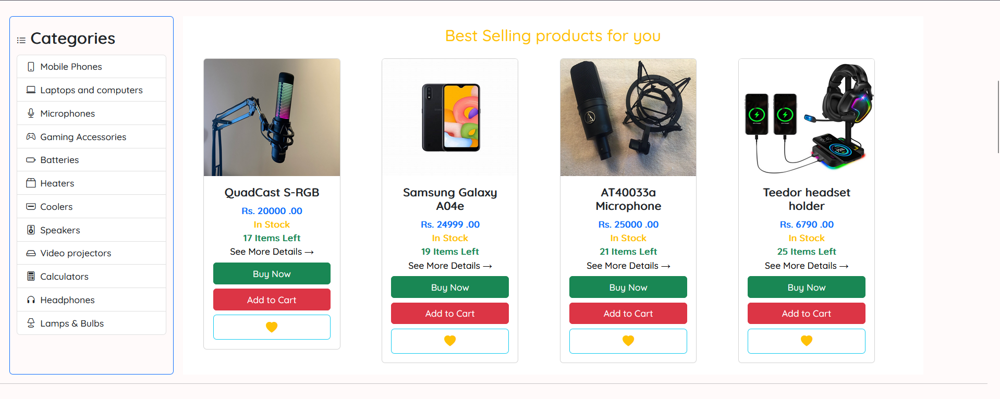
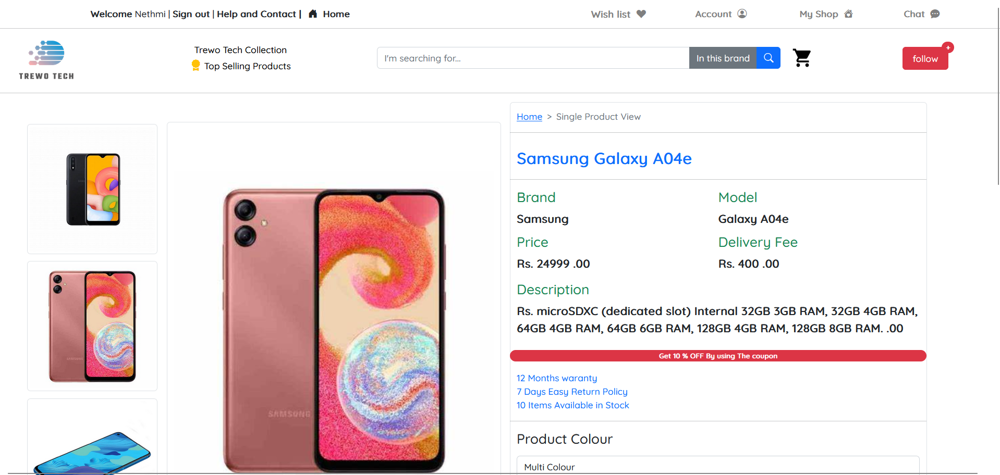
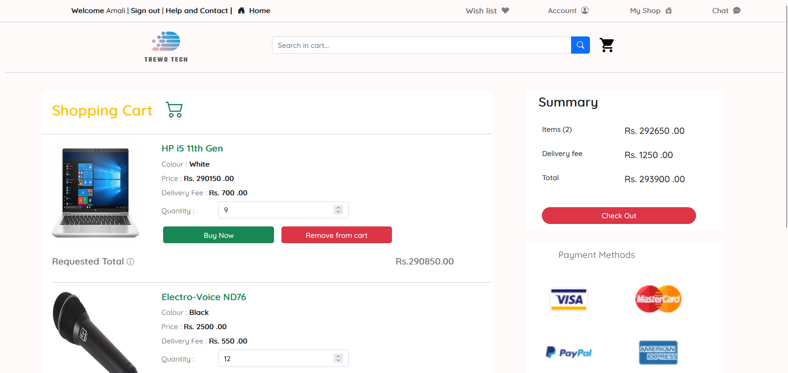
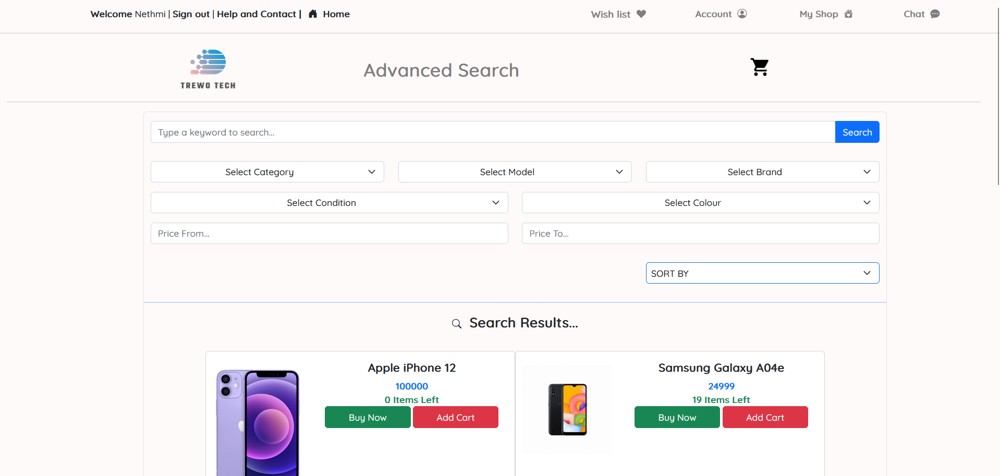

# E-Commerce Application

An e-commerce platform built with **HTML**, **CSS**, **JavaScript**, and **PHP**, specializing in **tech gadgets**. The application offers a seamless shopping experience with features like product browsing, cart management, and secure transactions via the **PayHere** payment gateway.

## 🚀 Features

- **Product Browsing**: Users can browse through various tech gadgets.
- **Cart Management**: Add, remove, and manage items in the shopping cart.
- **Secure Payment Gateway**: Seamless transactions using the **PayHere** payment gateway for secure payments.
- **Product Details**: View detailed information about each product, including images, price, and description.
- **Responsive Design**: Fully responsive layout, optimized for mobile and desktop browsing.

## 🛠️ Technologies Used

- **Frontend**: HTML, CSS, JavaScript
- **Backend**: PHP
- **Database**: MySQL
- **Payment Gateway**: PayHere
- **Hosting**: Web hosting with PHP support (e.g., Apache)

## 📸 Screenshots

<div style="display: flex;">
  &nbsp;&nbsp;&nbsp;
  &nbsp;&nbsp;&nbsp;
  
</div>
<div style="display: flex;">
  &nbsp;&nbsp;&nbsp;
  &nbsp;&nbsp;&nbsp;
  
</div>
<div style="display: flex;">
  &nbsp;&nbsp;&nbsp;
  
</div>

## 🛠️ Installation

### 1. Clone the Repository

```bash
git clone https://github.com/your-username/ecommerce-app.git
cd ecommerce-app
